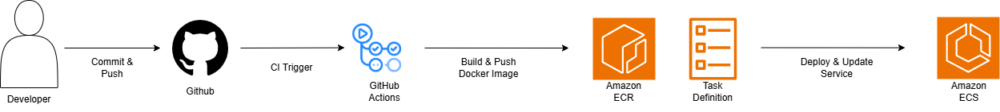
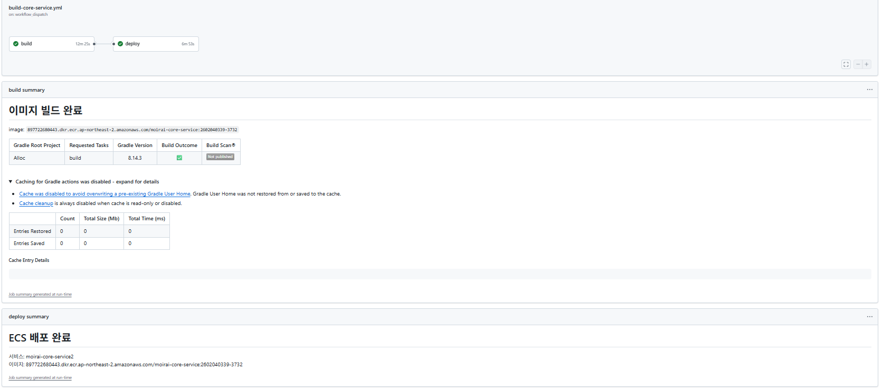
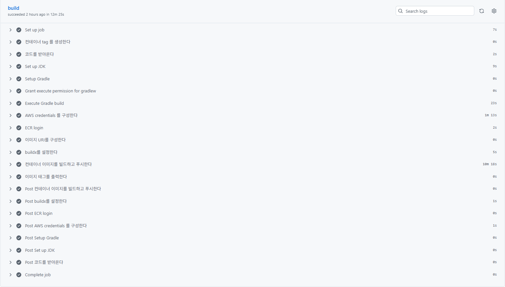
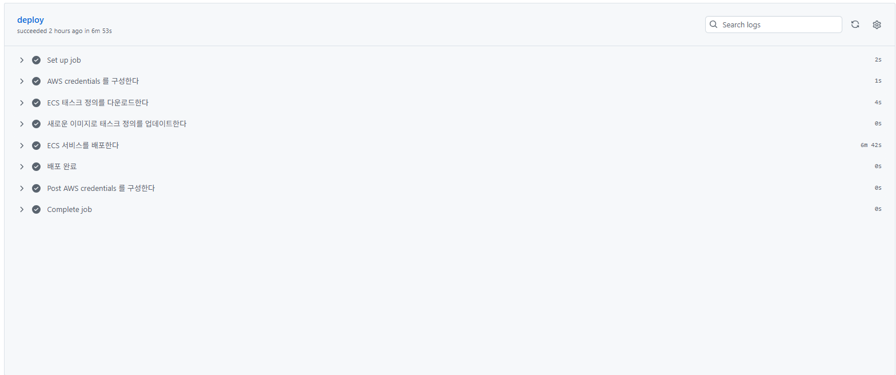
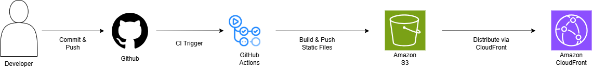
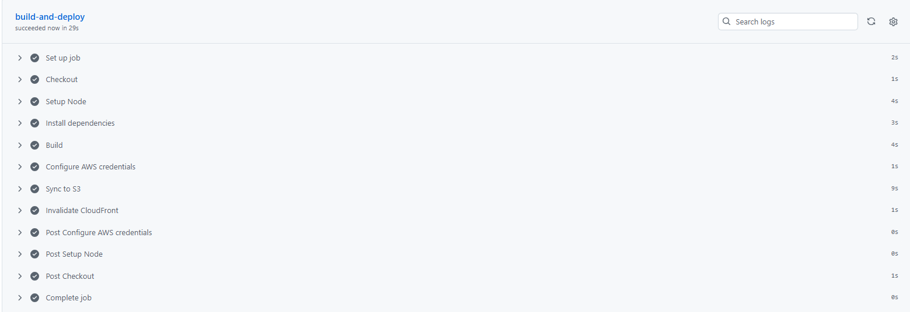

# 🚀 Alloc

**Alloc**은 *메모리를 할당(Allocate)하듯*,  
프로젝트의 **요구사항 · 일정 · 인력 역량**을 종합적으로 고려해  
**최적의 인력을 배치하고 프로젝트 운영을 지원하는 PM Tool**입니다.

IT 프로젝트에서 PM이 겪는  
- 인력 배치의 불확실성  
- 일정 관리의 복잡성  
- 진행 상황 파악의 어려움  

을 해결하는 것을 목표로 합니다.

---

## 🎯 프로젝트 목표

- 프로젝트 요구사항과 인력 역량 간 **정합성 향상**
- 인력 배치 및 일정 관리의 **가시성 강화**
- PM 의사결정을 돕는 **관리 중심 도구 제공**

---

## 🧩 핵심 기능

- **프로젝트 관리**
  - 프로젝트 생성 및 기본 정보 관리
  - 기술 스택, 직군, 기간 설정

- **인력 배치**
  - 역할 / 기술 스택 / 일정 기반 인재 추천
  - 프로젝트 인원 선발 및 추가 배정
  - 응답 상태 관리 (요청 / 수락 / 면담 / 확정)

- **일정 관리**
  - 캘린더, 간트 차트, 마일스톤 기반 일정 관리
  - 프로젝트 일정 한눈에 확인

- **진척 현황 관리**
  - 프로젝트 진행 상태 시각화
  - 변경 이력 관리 (확장 가능 구조)

---

## 🏗 시스템 아키텍처

---

## 🛠 기술 스택
### 🎨 Design

### 💻 Frontend

### 🗄 Database

### ⚙ Backend

### 🤝 Collaboration

### 🚀 CI/CD

### 🤖 AI

---

## 🗂 문서 링크 모음

### 📘 기획 및 설계
- **프로젝트 기획서**  
  👉 https://docs.google.com/document/d/14nblNrg7cs79-tRuyx1G-IyQSu4VreXTNj0hC7ef214/edit

- **요구사항 정의서**  
  👉 https://docs.google.com/spreadsheets/d/13ujhnsdJ3jMCO3p6hz1_swOi9t_xN-WjZ-ZYx5wCbhk/edit

- **WBS**  
  👉 https://docs.google.com/spreadsheets/d/1mPJ6UKxQZNp0anNGH0AcKaa_K402aaPGrOiU8Jtvq-g/edit

- **ERD**  
  

---

### 🎨 UI / UX
- **화면 설계서 (Figma)**  
  👉 https://www.figma.com/design/kvcpQG0Ngh2SxiFlUpbg3w/Alloc

- **UI/UX 테스트 결과서**  
  👉 https://docs.google.com/spreadsheets/d/1NMmfMxpjvc9iqrPi6JGYub-fwfCUwp2pQjR5YVK1uVM/edit

---

### 🔗 API & 테스트
- **API 명세서**  
  👉 https://www.notion.so/API-2e0341a375a580d2b655d0b3051eec79

- **단위 테스트 결과**  
  

- **통합 테스트 결과**  
  👉 https://docs.google.com/spreadsheets/d/1cvhOUu6IkRdQFFf9j1bP0VkYLdPPdypS3vugqQwlVOo/edit?gid=0#gid=0

---

### 🚚 CI/CD 계획서
- **백엔드 CI/CD**

- 백엔드 코드는 GitHub Actions 기반으로 **빌드 → 테스트 → 컨테이너 배포**까지 자동화되어 있습니다.
  
  
  
  

**Flow**
1. **Commit & Push**: 백엔드 소스 코드 변경 사항을 GitHub에 푸시
2. **CI (GitHub Actions)**: Gradle 빌드 및 테스트 수행
3. **Containerize**: Docker 이미지 빌드
4. **Registry (Amazon ECR)**: Docker 이미지를 ECR에 Push
5. **Release**: 새로운 **ECS Task Definition** 등록(이미지 태그 반영)
6. **Deploy (Amazon ECS)**: ECS Service 업데이트 및 롤링 배포로 신규 태스크 적용

- **프론트엔드 CI/CD**
- 프론트엔드는 GitHub Actions 기반으로 **빌드 → S3 업로드 → CloudFront 배포**까지 자동화되어 있습니다.
  
  

 **Flow**
1. **Commit & Push**: 프론트엔드 소스 코드를 GitHub에 푸시
2. **Build (GitHub Actions)**: 의존성 설치 후 정적 빌드 산출물 생성
3. **Publish (Amazon S3)**: 빌드 결과물을 S3 버킷에 업로드(정적 호스팅)
4. **Deliver (Amazon CloudFront)**: CloudFront를 통해 전 세계 엣지로 정적 리소스 배포  
   - 필요 시 캐시 무효화(Invalidation)로 변경 사항 즉시 반영 
---

### 🔀 협업 및 형상 관리
- **Git 형상 관리 전략**  
  

---

## ✨ 프로젝트 특징 요약

- PM 관점에서 설계된 **인력 중심 프로젝트 관리 도구**
- 추천 → 선발 → 배정 → 확정까지 이어지는 **명확한 인력 관리 흐름**
- 실제 협업을 가정한 **문서 · 테스트 · 형상 관리 체계 포함**

---

## 🎥 기능 미리보기 (GIF)

### 🔐 인증 및 계정 관리
**로그인**  

**비밀번호 재설정**  

---

### 📂 프로젝트 관리
**프로젝트 등록**  

**프로젝트 상세 조회 대시보드**  

---

### 👥 인력 관리
**인재 검색**  

**인재 추천 (1단계)**  

**인재 추천 (2단계)**  

---

### 🗓 일정 및 협업 관리
**마일스톤 / 태스크 관리**  

**캘린더 일정 관리**  

---

### 📝 문서 관리
**문서 관리 (주간보고 / 회의록 등)**  

---

### ⚠️ 리스크 관리
**리스크 관리 (관리자 지침서 기반 위험 분석 및 자동 리포트 생성)**  

